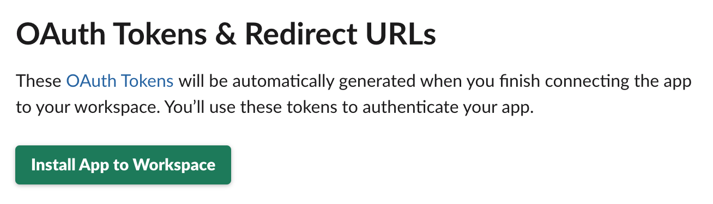

# WA Animals - EventBridge sign-in

## Slack Setup





## Serverless Deploy

```bash
# MFA Workaround
response=$(aws sts assume-role --role-arn arn:aws:iam::XXXXXXXXXXXX:role/DevOpsAdmin --role-session-name "Serverless")

# Set Variables
export AWS_ACCESS_KEY_ID=$(echo $response | jq -r '.Credentials.AccessKeyId')
export AWS_SECRET_ACCESS_KEY=$(echo $response | jq -r '.Credentials.SecretAccessKey')
export AWS_SESSION_TOKEN=$(echo ${response} | jq -r '.Credentials.SessionToken')
```

```bash
serverless deploy --stage dev
```

## Event Bridge


## Testing


